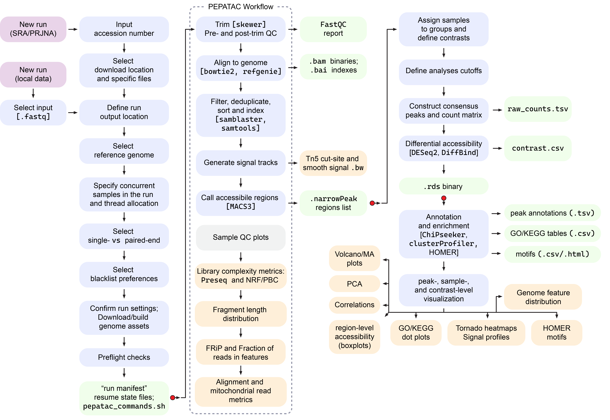
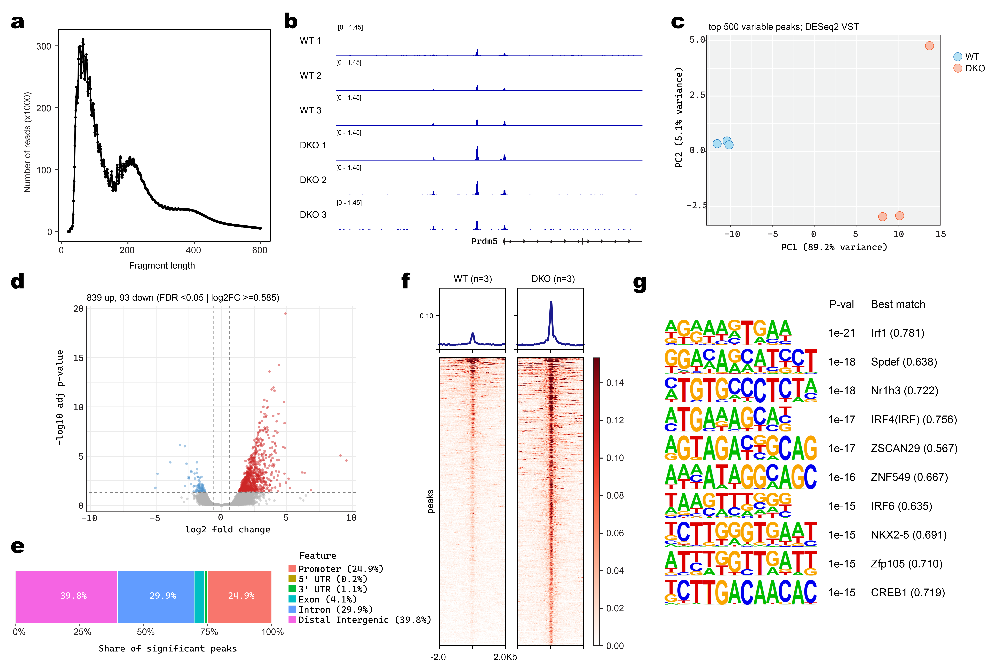

# FetchPA

FetchPA is an interactive, end-to-end ATAC-seq workflow for local Windows (WSL) or Linux machines. The four included scripts carry raw FASTQ files — either local or downloaded via SRA/ENA accession — through read processing with PEPATAC, differential accessibility analysis, peak annotation, enrichment analysis, and interactive exploration of the results. No scripting is required to run it FetchPA, isntead using a guided-prompt methodology. 

Developed by **Dustin Fetch**, in the **Soshnev Lab** (University of Texas at San Antonio).

The project contains four bash scripts, each covering one stage:

| Script | Stage | What it does |
|---|---|---|
| `FetchPA_install.sh` | **Install** | Sets up Miniconda, the `FetchPA` environment, PEPATAC, reference-management tools, and all required command-line and R/Bioconductor packages. |
| `FetchPA_run.sh` | **Process** | FASTQ → QC/trim → align → filter → call peaks. Produces BAM, narrowPeak, BigWig, and QC files for each sample. |
| `FetchPA_diff_analysis.sh` | **Differential accessibility** | Builds a consensus peak set with DiffBind, runs contrast-specific DESeq2 analysis, annotates peaks, and performs optional motif and GO/KEGG enrichment. |
| `FetchPA_explore.sh` | **Explore** | Menu-driven, on-demand exploration (PCA, volcano/MA plots, peak boxplots, enrichment plots, and tornado plots) of a completed analysis. |

Each script is interactive: it collects all user settings upfront, and once confirmed, runs the entire stage independent of further user input.

## Workflow overview



*Configuration and settings feed into read processing, alignment, peak calling, and differential analysis, which in turn feeds the exploratory analysis stage — matching the install → run → diff analysis → explore pipeline below.*

---

## Requirements

- **OS:** WSL (Ubuntu) on Windows, or a native Linux machine. `x86_64` only — the installer downloads the x86_64 Miniconda build and will stop on unsupported architectures.
- **Shell:** bash.
- **Disk space:** at least 10 GB free under the Linux home directory for installation alone. Genome assets and real sequencing runs require substantially more space. Before processing, the runner recommends free output space equal to approximately **6× the selected FASTQ size**.
- **RAM and CPU:** requirements depend on the genome, dataset size, thread count, and number of samples processed concurrently. The runner warns when the requested settings may oversubscribe available resources.
- **Internet:** required for installation, automatic reference and blacklist downloads, optional HOMER genome packages, and SRA/ENA-based input.
- **Permissions:** `sudo` access is required while installing base Ubuntu packages.

With the exception of standard Ubuntu packages and the Rust-installed `gtars` executable, all programs are installed into the self-contained `FetchPA` conda environment.

---

## Quick start

**1. Set up WSL** *(run PowerShell as administrator, skip if using native Linux)*

```powershell
# Install WSL
wsl --install -d Ubuntu

# Create a user and password when prompted during install

# Verify Ubuntu is using WSL2
wsl --list --verbose

# If necessary, convert WSL1 to WSL2
wsl --set-version Ubuntu 2
```

**2. Run the pipeline** *(inside WSL / Linux)*

```bash
# 1. Place the FetchPA scripts into a folder in the Linux filesystem

# 2. Navigate to the folder holding the scripts
cd 'FetchPA Pipeline'

# 3. Make the scripts executable
chmod +x FetchPA_*.sh

# 4. Install tools (first time only)
./FetchPA_install.sh

# 5. Process reads → BAM, narrowPeak, and BigWig files
./FetchPA_run.sh

# 6. Differential accessibility analysis
./FetchPA_diff_analysis.sh

# 7. Explore the results interactively (optional, repeatable)
./FetchPA_explore.sh
```

After the initial setup of each script (with the exception of the installer), you'll be prompted through a series of questions related to processing and analysis settings. Sensible defaults are shown in brackets, so you can often just press Enter.

The runner, differential-analysis script, and explorer accept Linux paths and common paths pasted from Windows File Explorer, including `C:\...`, `F:/...`, and `\\wsl.localhost\...` paths.

---

## 1. Installer — `FetchPA_install.sh`

This script prepares your machine to run the rest of the pipeline. It:

- installs standard Ubuntu build and runtime packages
- installs Miniconda if it is not already present
- creates the `FetchPA` conda environment (Python 3.10, R 4.3)
- installs PEPATAC, PEPATACr, Looper, Refgenie, HOMER, and the required command-line tools
- installs the R/Bioconductor stack for differential accessibility, annotation, enrichment, and plotting
- installs Rust and `gtars` for PEPATAC fragmentation scoring
- initializes Refgenie at `~/refgenie/refgenie.yaml`
- writes full and minimal conda environment exports for reproducibility
- creates `pepatac_check.sh` for later installation verification
- installs pinned, known-good versions of the core tools:

  | Tool | Version | Used for |
  |---|---|---|
  | Bowtie2 | 2.5.4 | short-read alignment |
  | samtools | 1.21 | BAM filtering, sorting, indexing, and validation |
  | BEDTools | 2.31.1 | genomic interval operations |
  | FastQC | 0.12.1 | read-quality assessment |
  | MACS3 | 3.0.2 | ATAC-seq peak calling |
  | deepTools | 3.5.6 | coverage tracks, matrices, heatmaps, and profiles |
  | samblaster | 0.1.26 | duplicate handling during alignment |
  | Skewer | 0.2.2 | ATAC-seq adapter trimming |
  | Trim Galore | 0.6.11 | trimming wrapper used by supporting workflows |
  | cutadapt | 5.2 | trimming backend |
  | Looper | 2.1.1 | pipeline execution support |
  | `gtars` | 0.9.0 | fragmentation scoring |
  | `csaw` | 1.36.0 | background-bin support for DiffBind normalization |

Preseq, HOMER, Refgenie, and most R/Bioconductor packages are installed as compatible environment-level dependencies rather than individually pinned packages. The installer records the resolved environment so the exact versions used on a machine remain available for reproducibility.

It does **not** download large genome assets or HOMER genome packages — those are acquired only after a run is configured and confirmed.

---

## 2. Runner — `FetchPA_run.sh`

This is the main processing script. It turns raw ATAC-seq FASTQ files into per-sample alignments, coverage tracks, peak calls, and QC records using the independently created PEPATAC pipeline(https://github.com/databio/pepatac).

**Pipeline per sample:**

```
FastQC → Skewer adapter/quality trimming → Bowtie2 alignment
  → mitochondrial/duplicate filtering → MACS3 peak calling
  → BAM + narrowPeak + BigWig + QC reports
```

**Input options**

- A local folder of FASTQ files (paired- or single-end, auto-detected), **or**
- A public **SRA study (`SRP...`) or BioProject (`PRJNA...`) accession**. The runner queries ENA, previews the available runs, allows selection of a subset, verifies available MD5 checksums, and downloads the FASTQs directly.

**Reference genomes**

Built-in assemblies: `hg38`, `mm10`, `rn7`, `dm6`, and `danRer11`. Sequence assets are reused on later runs after being downloaded or built. A **user-defined genome profile** can also be created for another UCSC assembly by providing compatible TxDb and OrgDb packages, with an optional KEGG organism code and effective genome size.

Versioned standard blacklists are available automatically for `hg38`, `mm10`, and `dm6`. A compatible custom BED blacklist may be supplied for other assemblies.

**Handy features**

- **Resume:** re-enter a previous output folder; valid completed samples are skipped, while failed, interrupted, incomplete, or stale samples are retried.
- **Concurrent processing:** choose the number of simultaneous samples and CPU threads assigned to each sample.
- **Persistent path defaults:** append `-newdefault` to an output-base or SRA-download path to reuse it in future runs.
- **Windows-path friendly:** paste paths directly from File Explorer and they are converted automatically.
- **Preflight validation:** checks the environment, pipeline, references, annotations, FASTQs, blacklist, output directory, and disk space before launch.
- **Reproducibility records:** saves processing commands, run settings, reference fingerprints, sample status, and output paths.

**Output layout:**

```
<run_output>/
├── <sample_1>/                    PEPATAC BAM, peak, BigWig, QC, and report files
├── <sample_2>/
├── logs/                          per-sample logs and status records
├── reference_snapshot/           frozen, fingerprinted reference metadata
├── run_manifest.txt              run settings and provenance
├── pepatac_commands.sh           generated command log
├── qc_summary.csv                PASS/FAIL, peak counts, BAM sizes, and paths
├── samples_for_R_template.csv    editable sample-sheet template
└── samples_for_R_autodetected.csv
```

The `samples_for_R_autodetected.csv` file is the normal input for the next step.

---

## 3. Differential accessibility — `FetchPA_diff_analysis.sh`

This script reads a completed runner output folder, builds a shared consensus peak set with DiffBind, and performs contrast-specific differential accessibility testing with DESeq2. It prompts you to confirm BAM and peak files, exclude unsuitable samples, assign groups, define case-vs-control contrasts, confirm the genome and annotation profile, select analysis thresholds, and optionally run HOMER motif analysis.

All included samples contribute to the shared consensus peak set, read-count matrix, and global PCA. Each contrast is then subset, normalized, and tested independently so unrelated groups do not affect its statistical model. Groups require at least two samples; contrasts involving a one-sample group are skipped.

For each completed contrast, the script produces differential-accessibility tables, Up/Down BED files, ChIPseeker peak annotations, gene lists, GO enrichment, optional KEGG enrichment, and optional HOMER known and/or de novo motif enrichment. Annotation and enrichment are run for the combined significant set and separately for Up and Down peaks.

**Once per run**, `FetchPA_diff_analysis.sh` writes `explorer_bundle.rds`. This bundle contains the VST-normalized peak matrix, completed contrast results, sample metadata, thresholds, annotation availability, and BAM paths — so DiffBind does not need to be rebuilt to browse the results.

---

## 4. Explorer — `FetchPA_explore.sh`

This script is pointed at the `explorer_bundle.rds` generated by `FetchPA_diff_analysis.sh`. After loading the bundle, it presents an interactive menu that generates figures on demand, in any order:

1. **PCA** — choose any subset of at least three samples and the number of variable peaks used
2. **Volcano + MA plots** — select a contrast, effect-size estimate, thresholds, axis limits, and optional peak labels
3. **Peak accessibility boxplots** — enter genomic coordinates or result-table row indices; view raw and normalized accessibility side by side
4. **Sample correlation heatmap** — select samples and Pearson or Spearman correlation
5. **Motif summary** — export top known TF motifs when HOMER results are available
6. **Annotation distributions** — genomic-feature, TSS/TES-distance, gene-body, peak-width, and chromosome plots
7. **GO/KEGG summary** — redraw saved enrichment results as dot plots
8. **Tornado plot and profile** — visualize signal around differential peaks using deepTools with configurable samples, windows, sorting, and peak sets

Because the differential results and VST matrix are already stored, most plots are generated rapidly and do not reread the original BAM files. Tornado plots are the main exception because they use deepTools to create or reuse BigWigs and calculate signal matrices.

### Example output




*(Replace this caption with the panel-by-panel description of your final FetchPA example figure.)*

---

## Typical workflow

```
install  →  run  →  diff analysis  →  explore
 (once)    (per       (define groups     (browse
          dataset)     & contrasts)       results)
```

1. Run `FetchPA_install.sh` once on a new machine.
2. Run `FetchPA_run.sh` for each ATAC-seq dataset.
3. Inspect `qc_summary.csv` and the per-sample PEPATAC QC reports.
4. Run `FetchPA_diff_analysis.sh` to exclude unsuitable samples, define groups and contrasts, and generate differential results.
5. Run `FetchPA_explore.sh` whenever you want to generate or revise plots.

---

## Notes & troubleshooting

- **Everything runs inside `FetchPA`.** The scripts activate the conda environment for you; manual activation is normally unnecessary.
- **Keep working data in the Linux filesystem when possible.** Linux-native paths generally provide more reliable permissions and better I/O performance than Windows-mounted drives under WSL.
- **Use one library layout per run.** Process paired-end and single-end samples separately.
- **Merge sequencing lanes before running.** The runner does not silently concatenate lane FASTQs.
- **Check ambiguous `_1`/`_2` names carefully.** These suffixes may indicate read mates or independent replicates.
- **Resume after failures.** Valid prior PASS samples are skipped; failed or incomplete samples are retried.
- **Genome builds happen once.** The first build may take one to two hours, but the reference is cached and reused.
- **Do not ignore annotation-integrity failures.** They indicate that reference or annotation resources may describe different assemblies.
- **Reset saved defaults** by deleting `~/.pepatac_run_defaults.sh`.
- **Verify the installation** at any time with `pepatac_check.sh`.
- **SRA/ENA input only works for public, released data.** Private, controlled-access, or embargoed records may not resolve through ENA.

---

## Citation

A citation for FetchPA is on the way. In the meantime, if you use this pipeline in your work, please credit:

> Dustin Fetch, Soshnev Lab, University of Texas at San Antonio.

FetchPA runs the independently developed [PEPATAC](https://github.com/databio/pepatac) workflow and uses numerous third-party bioinformatics tools. Please also cite PEPATAC and the major underlying tools used in your analysis according to their current citation guidance.

This section will be updated with a formal citation (paper/DOI) once available.
